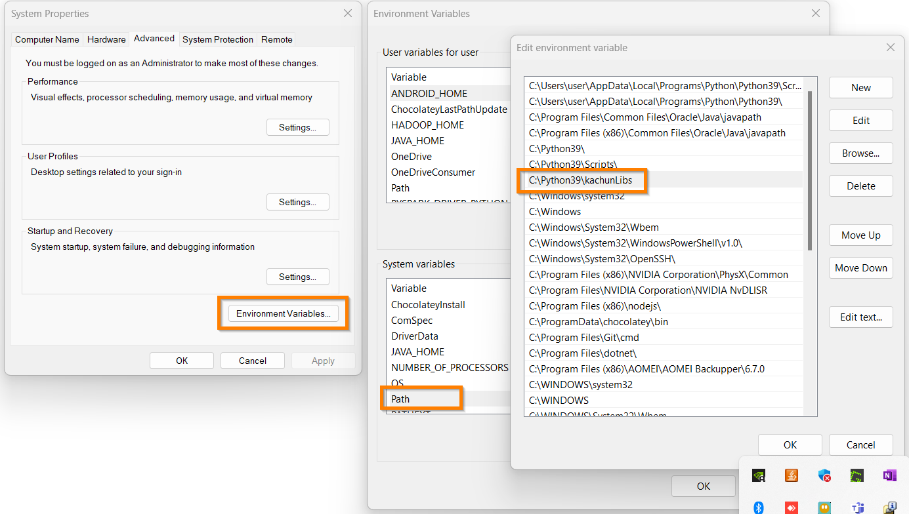

# JupyterOfDataScraping
Use Python to scrap data from the internet
# For DownloadImages2 Demo
This example shows how to import a custom class. 
The steps are:
1. Create a library folder i.e. C:\\PythonLibs
2. Copy the class i.e. DownloadImage in DownloadImages3 and save it as myModule.py in the library folder i.e. C:\\PythonLibs\\myModule.py
3. In any Python IDE such as Jupyter Notebook or IDLE, import this library by:
   ```
   import sys
   sys.path.append("C:\\PythonLibs")
   from myModule import DownloadImage
   ```
4. Use the library by:
   ```
   url = 'http://goodview.125mb.com/photostyle.html'
   objDL = DownloadImage(url)
   objDL.download()
   ```
5. If the custom module is put in the same folder as the python file. The code in step 3 is replaced by:
   ```
   sys.path.append(".")
   ```
6. If the custom module myModule.py is put in the path: C:\\Python39\\kachunLibs which is added in the environment variable's Path
   
   

7. import the library directly without using sys
   ```
   from myModule import DownloadImage
   url = 'http://goodview.125mb.com/photostyle.html'
   objDL = DownloadImage(url)
   objDL.download()
   ```
